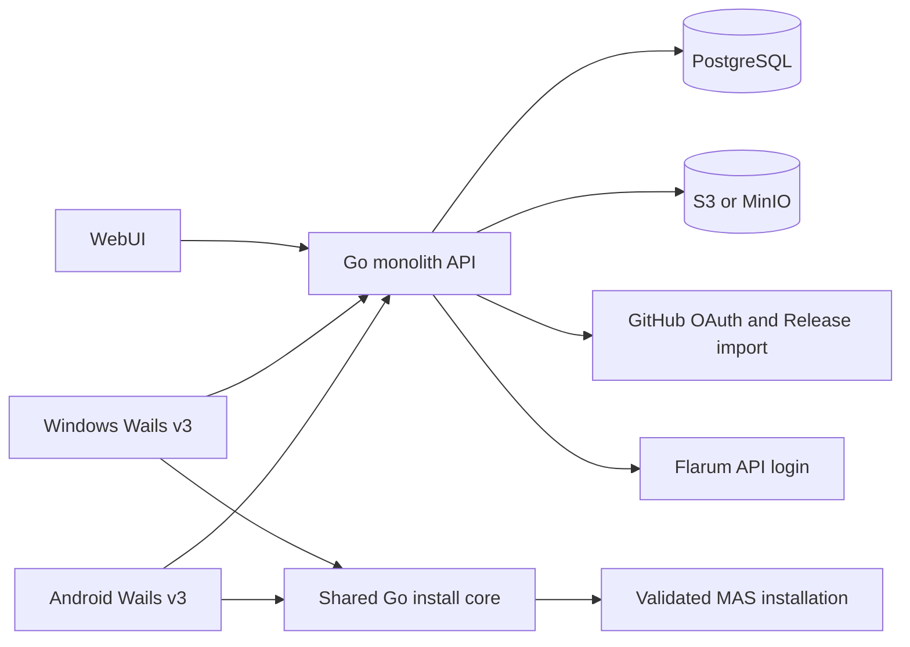

# Reze SubmodHub Design

Date: 2026-09-25
Status: approved in conversation
Scope: centralized public MAS submod store, author publishing portal, Windows and Android installer clients

## Purpose and boundaries

Provide a public catalog for Monika After Story (MAS) submods and sprite packs. Authors upload existing ZIP packages through a web workbench; reviewers publish versions. Windows and Android users browse the catalog and install, update, reorder, uninstall, and recover submods through Wails v3 clients. The target MAS tree is `J:\MonikaModDev-zhCN\Monika After Story\game`; it is a compatibility reference, not a repository to modify for this project.

The first release accepts legacy ZIPs without requiring an embedded manifest. The WebUI provides listing, author submission, and review functions; visual design and frontend implementation are assigned to another agent. There is no browser code editor or visual ZIP packager in this scope. The store does not alter MAS saves or execute uploaded scripts while scanning.

The first official release must include both PC (Windows) and Android Wails v3 clients. Both clients must support catalog browsing, MAS installation validation (Windows directory selection; Android fixed-root validation), install, priority conflict handling, update, uninstall, and recovery. A working service or a working client on only one platform is an intermediate milestone, not completion of the requested product. If either platform fails its release gate, the joint first release is blocked until the design is revised with the user.

## Observed MAS conventions

MAS has `game/Submods`, `game/mod_assets`, and `game/python-packages`. `zz_submods.rpy` registers `Submod(name, version, dependencies, ...)`; duplicate registered names raise an error. The built-in ZIP installer maps several top-level directories into the MAS tree and accepts loose `.rpy`/`.rpym` files under `Submods/UnGroupScripts`. It may create `.gift` files from sprite JSON `giftname` values under `AvailableGift`. Its current copy/delete flow does not provide durable per-file ownership. The MAICA sample spans `game/Submods/MAICA_ServerSubmod` and `game/python-packages`, so directory-only ownership is insufficient.

The earlier Android MAS build reference `/storage/emulated/0/Android/data/and.kns.masmobile/files` is superseded by the user-confirmed installation root `/storage/emulated/0/MAS/`, with game files under `/storage/emulated/0/MAS/game`. The Android client is distributed as a sideloaded APK and targets Android 11+ for this storage flow. It declares `MANAGE_EXTERNAL_STORAGE`, opens the app-specific All files access settings screen on user action, and checks `Environment.isExternalStorageManager()` on launch, return from settings, and before managed file operations. The fixed path and manifest declaration do not grant access. Denial or revocation blocks managed reads/writes and exposes a retry action; there is no silent SAF fallback. Wails v3 Android support is experimental, so the native bridge and filesystem access must be proven on real devices.

## Architecture

The Go service owns catalog, identity, submissions, review, release metadata, and storage. Published ZIPs are immutable objects addressed by version ID and SHA-256. A shared Go package owns ZIP inspection, MAS path normalization, dependency checks, conflict planning, local state, file application, and recovery. Windows and Android Wails shells call that package through bindings. The Android Wails host exposes an All files access status/settings bridge; after a positive grant check, the Go core uses ordinary filesystem operations restricted to the validated MAS root. No separate Kotlin application is planned.

The service is self-hostable as one API process, PostgreSQL, and S3-compatible object storage, including MinIO. GitHub can supply login and Release imports; the service database and object store remain the authoritative source for published versions. Docker Compose is the initial deployment target.

## Identity and roles

Public catalog and downloads need no account. Authors, reviewers, and administrators log in. Roles are `user`, `author`, `reviewer`, and `admin`. A GitHub user begins as `user`; an administrator grants author or reviewer rights. The Flarum provider follows the MAS_UniSync pattern: the service accepts credentials over HTTPS, calls Flarum `/api/token`, fetches `/api/users/{id}`, discards the password, and creates its own session. Configured Flarum group IDs or names map to local roles and refresh on login. This is Flarum API login, not OAuth. GitHub uses OAuth authorization code with state and PKCE where supported. External identities use `(provider, provider_user_id)` as keys; users initiate account linking while already authenticated, never by matching display names.

## Catalog and publication model

`Mod` has a stable ID, title, summary, author, category (`submod` or `spritepack`), tags, supported platforms, compatible MAS version range, and recommended priority. `ModVersion` has a version string, immutable ZIP object, SHA-256, size, release notes, dependencies, scan report, and state. `Submission` records creator, candidate version, review state, reviewer, rationale, and timestamps. `Source` optionally records a GitHub repository and Release asset mapping. Author metadata is authoritative for dependencies; static script inspection produces corroborating warnings only.

Submission states: `draft → uploaded → scanning → ready_for_review → approved → published`; scan failure or reviewer rejection returns to `draft`/`rejected` with reasons. New versions of an existing mod have independent reviews. Approving a version does not mutate previously published ZIPs. Removal from public listings is a reversible unpublish state; moderation actions are audited. File downloads use signed or proxied URLs and expose expected hash and size.

## Legacy ZIP inspection

The scanner never executes `.rpy`, `.rpym`, Python modules, or binaries. It first enumerates ZIP entries and rejects absolute paths, parent traversal, device names, symlink entries, repeated normalized paths, invalid names, and resource-limit violations. It then finds a supported package root and maps files relative to the selected MAS base directory. Supported legacy shapes include nested `game/`, top-level `Submods`, `mod_assets`, `python-packages`, `gui`, `custom_bgm`, `piano_songs`, and loose `.rpy`/`.rpym` scripts. Roots or files outside the explicit mapping are reported as unsupported, rather than silently placed. Script and binary files are allowed when their paths are supported but flagged for review; banning extensions would break legacy compatibility.

The scanner classifies each file as script, sprite JSON, image/audio, Python package, binary, gift, or other. It extracts MAS `Submod(...)` registrations and dependency hints only through bounded static parsing; failure yields `unknown`, not a guessed result. Sprite JSON under `game/mod_assets/monika/j` is parsed for `giftname` and sprite identity. Duplicate `giftname` or sprite identity across different JSON files, including the game's preexisting baseline, is a semantic conflict even when file paths differ. Existing MAS sprite gift generation is modeled as a derived output, with ownership and rollback; generated `.gift` files are never placed into a save directory.

## Local installation state and conflict policy

Each selected MAS installation gets a local state database stored outside the game tree when platform access allows. It tracks game identity, installed versions, package file maps, each target path's content stack, priority, applied hash, preexisting-file backup, operation journal, and backup retention. Windows probes known locations and offers a manual selector. Android validates the fixed MAS root only after checking All files access; the OS owns the grant and the client rechecks it on every launch and before operations.

Before first managed write, scan target paths into a baseline. A preexisting file with unknown provenance is `external`, not attributed to any mod. It is a protected bottom layer. The user's first installation into a game instance authorizes managed writes; any overwritten external file is backed up. Dependency resolution blocks missing mandatory dependencies, incompatible versions, and uninstall of a required version. Author declarations are primary; ambiguous script parsing is shown as a warning.

For each target path, the effective content is the highest-priority installed mod's file. Ties resolve deterministically by installation sequence and stable mod ID. A priority change produces a preview of changed paths before applying writes. Structural path conflicts are resolved by this ordering; semantic sprite conflicts and duplicate MAS registration names block installation until the conflicting package is removed or fixed. The installer never edits uploaded ZIPs or MAS saves to mask conflicts.

## Installation transaction and recovery

The client checks that MAS is not running, downloads to a temporary area, verifies size/hash, scans the ZIP, builds an explicit plan, checks disk space, and backs up every file that will be replaced or removed. It records `planned → backed_up → writing → committed` in a durable journal. Each write records expected old and new hashes. Windows and Android may use temporary files and same-volume rename where supported, but must not assume every Android filesystem/provider operation is atomic; the same journal supports restart recovery. An interrupted operation resumes or rolls back based on hashes. If the current file differs from the recorded expected hash, the client stops and asks the user to inspect the difference instead of overwriting their change.

Update is an install of a new version plus a planned removal of files exclusive to the old version. Uninstall removes only content owned by the managed version when the on-disk hash matches the journal, then restores the next active layer or original external file. Unknown manually installed mods are listed as detected/unmanaged when identifiable, but cannot be safely uninstalled until explicitly adopted through a scan and backup process. Backup pruning must preserve any content still referenced by an active stack or recoverable operation.

## Functional surfaces (no UI implementation in this plan)

WebUI: public catalog/search/detail/version pages; author dashboard and ZIP upload/scan/submission history; reviewer queue with file tree, warnings, decisions, and audit log; administrator role and configuration controls. Client: installation selector and authorization status; catalog/detail/download/installation preview; managed and unmanaged installed lists; dependency warnings; priority ordering and effective-file preview; update/uninstall/repair; operation history, backup recovery, and log export. The frontend agent receives API schemas, state machines, error codes, and required user journeys; layout and styling are outside this document.

## API and error contract

Versioned JSON API under `/api/v1`. Public endpoints cover catalog, mod detail, versions, scan summary, and download descriptor. Authenticated endpoints cover session, identity link, author drafts/uploads/submissions, reviewer queue/decisions, and admin role operations. Pagination uses opaque cursors; mutations use idempotency keys where upload/publication retries are possible. Errors have stable `code`, human-readable `message`, and optional `details`; clients localize `code` and may show `message` as fallback. Published version IDs, hashes, and archive bytes never change.

## Verification and release gates

1. **Android feasibility gate:** on a real Android 11+ device, a Wails v3 sideloaded APK builds and launches, declares `MANAGE_EXTERNAL_STORAGE`, opens the app-specific All files access settings page, observes the actual grant with `Environment.isExternalStorageManager()`, reads a ZIP, and writes/removes test files only inside a disposable shared-storage tree. Relaunch and grant revocation must update the state and block writes. A read-only probe validates the fixed MAS root separately. Failure blocks the joint first release and triggers a design review; no alternative framework or SAF fallback is silently substituted.
2. **Package compatibility:** fixture ZIPs cover MAICA's `Submods` plus `python-packages`, loose scripts, simple submods, sprite JSON/assets, nested roots, and invalid archives.
3. **Installer safety:** tests cover path traversal, ZIP bombs, case and Unicode collisions, external files, priority reorder, semantic sprite conflicts, interrupted writes, manual edits, upgrade, uninstall, and backup recovery.
4. **Service security:** tests cover both login providers, identity linking, role refresh, upload limits, review transitions, immutable publication, and download hashes.
5. **Main journeys:** author submits and reviewer publishes; Windows and Android users each locate MAS, install, reorder, update, uninstall, and recover. Windows can be automated; Android requires device-level evidence. Both platform reports are required for the first release.

## Known risks and non-goals

- Wails v3 Android support is experimental and its native All files access bridge must be validated before relying on it. `MANAGE_EXTERNAL_STORAGE` is a special-access grant with Google Play distribution restrictions; this design assumes sideloaded APK distribution.
- Legacy archives have no reliable file ownership or complete dependency metadata. Local journals make new managed installs reversible; they cannot reconstruct the history of existing manual installs.
- Static analysis cannot prove an uploaded script is harmless. Review reports surface suspicious content, and moderation remains responsible for publication.
- Existing MAS in-game installer/uninstaller may be used independently; the client detects drift before subsequent operations and stops on mismatched hashes.
- The first release does not provide an online script editor, visual packager, auto-execution of package hooks, save migration, automatic removal of unmanaged mods, or a separate native Android app.

## Planning inputs

**Task intent:** build a public MAS submod store with WebUI publication and Windows/Android Wails v3 installer clients, preserving legacy ZIP compatibility and resolving file overlaps by mod priority.

**Baseline read set:** target MAS `zz_submods.rpy`, built-in extractor/uninstaller, Android permission code, sprite JSON loader; MAICA package layout; MAS_UniSync Flarum auth client and design notes; Wails v3 Android docs/search result.

**Impact:** new service and client code in this repository; no changes to MAS or sample repositories. Compatibility boundaries are MAS file layout, runtime submod registration, legacy package shapes, and Android filesystem permissions.
